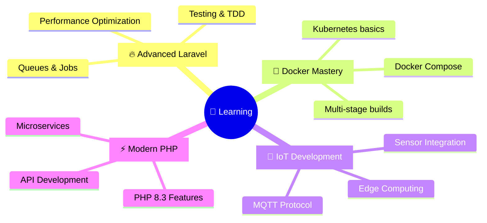

# 👋 Halo! Saya **[Ilham]**

<div align="center">
  


[](https://github.com/yourusername)
[](https://badges.pufler.dev)
[](https://badges.pufler.dev)
[](https://badges.pufler.dev)

</div>

---

## 🎮 **Mini Game: Tebak Stack Tech Saya!**

<details>
<summary>🎯 <b>Klik untuk bermain!</b></summary>

### 🔥 **Quick Quiz**: Teknologi mana yang paling sering saya gunakan?

**A)** React + Node.js  
**B)** Laravel + PHP  
**C)** Python + Django  
**D)** Vue.js + Express  

<details>
<summary>📝 <b>Lihat Jawaban</b></summary>

### ✅ **Jawaban: B) Laravel + PHP**

**Benar!** 🎉 Saya passionate banget dengan ekosistem Laravel dan PHP. Selain itu, saya juga aktif menggunakan:
- 🐋 **Docker** untuk containerization
- 🤖 **IoT & Mikrokontroller** untuk hardware projects
- ⚡ **Modern PHP** dengan best practices

**Bonus Point**: Saya juga suka eksperimen dengan hardware dan bikin project IoT yang keren! 🚀

</details>
</details>

---

## 🚀 **Tentang Saya**

```php
<?php

class Developer 
{
    public $name = "Nama Anda";
    public $location = "Indonesia 🇮🇩";
    public $role = "Full Stack Developer";
    
    public function getCurrentFocus(): array 
    {
        return [
            "🔥 Building awesome web apps with Laravel",
            "🐋 Mastering Docker containerization", 
            "🤖 Creating IoT solutions with microcontrollers",
            "⚡ Exploring modern PHP ecosystem",
            "📱 Developing responsive & interactive UIs"
        ];
    }
    
    public function getFunFact(): string 
    {
        return "I can make LEDs blink AND websites shine! ✨";
    }
}
```

---

## 🛠️ **Tech Stack & Tools**

<div align="center">

### **Backend & Framework**


### **DevOps & Tools**


### **Hardware & IoT**


### **Frontend**


</div>

---

## 📊 **GitHub Analytics**

<div align="center">
  


</div>

### 🔥 **Streak Stats**
<div align="center">
  
[](https://git.io/streak-stats)

</div>

---

## 🏆 **Featured Projects**

<div align="center">

| 🌟 **Project** | 📝 **Description** | 🚀 **Tech Stack** | 🔗 **Links** |
|----------------|--------------------|--------------------|---------------|
| **Smart Home System** | IoT-based home automation with web dashboard | Laravel, Arduino, ESP32, MySQL | [Demo](link) • [Code](link) |
| **E-Commerce Platform** | Full-featured online store with admin panel | Laravel, Docker, TailwindCSS | [Demo](link) • [Code](link) |
| **Weather Station** | Real-time weather monitoring with API | PHP, Arduino, Sensors, Chart.js | [Demo](link) • [Code](link) |
| **Task Management** | Collaborative project management tool | Laravel, Livewire, Alpine.js | [Demo](link) • [Code](link) |

</div>

---

## 📈 **Contribution Graph**

<div align="center">
  
[](https://github.com/ashutosh00710/github-readme-activity-graph)

</div>

---

## 🌱 **Currently Learning & Exploring**

<div align="center">



</div>

---

## 📫 **Mari Terhubung!**

<div align="center">

[](https://linkedin.com/in/yourprofile)
[](https://instagram.com/yourprofile)
[](mailto:your.email@gmail.com)
[](https://yourportfolio.com)

**💬 Let's collaborate on exciting projects!**

</div>

---

## 🎯 **Fun Facts & Hobbies**

<details>
<summary>🎪 <b>Klik untuk tahu lebih banyak tentang saya!</b></summary>

### 🤖 **Tech Enthusiast**
- 💡 Suka eksperimen dengan hardware dan bikin gadget DIY
- 🔧 Koleksi berbagai mikrokontroller dan sensor
- 📡 Passionate tentang IoT dan automation

### 🎨 **Beyond Code**
- ☕ Coffee addict - butuh caffeine untuk coding!
- 🎮 Gamer di waktu senggang
- 📚 Suka baca tentang emerging technologies
- 🎵 Coding sambil dengerin musik elektronik

### 🚀 **Goals 2024**
- [ ] Master advanced Docker & Kubernetes
- [ ] Contribute to open source Laravel packages  
- [ ] Build 5 IoT projects with real-world impact
- [ ] Launch personal tech blog
- [ ] Speak at local tech meetups

</details>

---

<div align="center">

### 💖 **Thanks for visiting my profile!**


---

**⭐ If you like my projects, give them a star!**  
**🤝 Open for collaboration and interesting projects**


</div>
